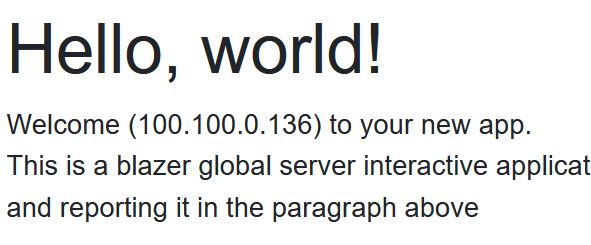

# Blazor Puzzle #68

## Raiders of the Lost HTTP Headers

YouTube Video:  https://youtu.be/MZVL99H4xMs

Blazor Puzzle Home Page:  https://blazorpuzzle.com

## The Challenge:

This is a blazer global server interactive application.  In this scenario,
we're grabbing your IP address using the HTTP headers and reporting it on the home page

When we're running locally on our developer workstation, this correctly reports the local IP address. 

When we're running on Azure Container Apps or another hosted service the IP address doesn't match our public facing address.

How do we fix this?